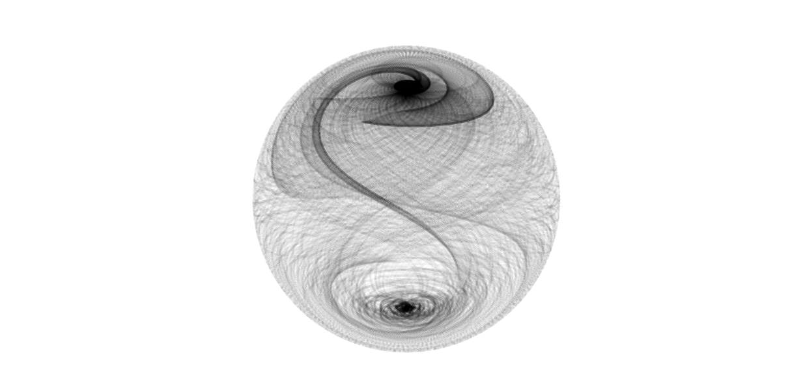
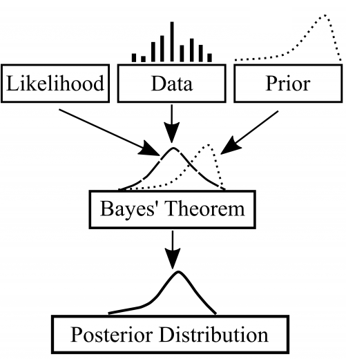

# Hadithi
🧪 Data Science | ⚒️ MLOps | ⚙️ DataOps : Talks about 🦄

> mathematically generated 

_Hadithi_ is a Swahili word for story | stories. These are collections of resources, successful and failed project stories, building ML projects that last, design patterns, code testing, and how to navigate in the rapidly changing tech landscape. These stories, sagas and opinions are my own. They neither reflect the companies I have worked or working for, nor should they be taken seriously.

Hadithi is also a home of tools 🛠️, packages 📦  and libraries 🏗️ I found useful or nice playing with.
### [_Sura ya Kwanza_](https://github.com/Proteusiq/hadithi/tree/main/mlfluke)
Understanding machine learning predictions. What you see is not always what you get 🤖. 

Machine Learning Resources
- [An Introduction to Statistical Learning](https://www.statlearning.com/) - Gareth James, Daniela Witten, Trevor Hastie, Robert Tibshirani
- [Introduction to Machine Learning](https://openlearninglibrary.mit.edu/courses/course-v1:MITx+6.036+1T2019/course/) - MIT Open Learning Library
- [CS229 - Machine Learning](https://see.stanford.edu/Course/CS229) - Andrew Ng Stanford University
- [CS50's Introduction to Artificial Intelligence with Python](https://pll.harvard.edu/course/cs50s-introduction-artificial-intelligence-python?delta=0) - Harvard School of Engineering and Applied Sciences 
- [Mathematics for Machine Learning](https://mml-book.github.io/) - PDF, video and Jupyter Notebooks for introductions to mathematics required for ML
- [Machine Learning Foundations](https://github.com/jonkrohn/ML-foundations) - Classical Notebooks, Udemy|Youtube course covering Maths and Code by Jon Khrohn
- [Python Data Science Handbook](https://nbviewer.org/github/jakevdp/PythonDataScienceHandbook/blob/master/notebooks/Index.ipynb) - Jake VanderPlas
- [ML for Beginners](https://microsoft.github.io/ML-For-Beginners/) - Microsoft - Diagrams, Code, Scikit-learn
- [Probability Distribution Explorer](https://distribution-explorer.github.io/index.html#) - Probability distributions and the stories behind
- [Understanding Machine Learning: From Theory to Algorithms](https://www.cs.huji.ac.il/~shais/UnderstandingMachineLearning/understanding-machine-learning-theory-algorithms.pdf) - Cambridge PDF - Shai Shalev Shwartz and Ben David
- [Gallery if Distributions](https://www.itl.nist.gov/div898/handbook/eda/section3/eda366.htm) - Handbook of [Statistical Methods](https://www.itl.nist.gov/div898/handbook/)
- [mlcourse.ai](https://mlcourse.ai/book/index.html) - Open Machine Learning Course

ML Visually
- [Illustrated ML](https://illustrated-machine-learning.github.io/) - 👑
- [Seeing Theory](https://seeing-theory.brown.edu/index.html) - A visual introduction to probability and statistics 💎
- [MLU-Expl{ai}n](https://mlu-explain.github.io/) - Visual explanations of core machine learning concepts
- [Distill](https://distill.pub/) - Machine Learning Research Should Be Clear, Dynamic and Vivid

> Bayesian Inference

 

- [Think Bayes](http://allendowney.github.io/ThinkBayes2) - Allen Downey’s classic as Jupyter Book
- [Bayesian Modeling and Computation in Python](https://bayesiancomputationbook.com/welcome.html) - Martin Osvaldo A, Kumar Ravin; Lao Junpeng, 2021
- [Bayesian Methods for Hackers](http://camdavidsonpilon.github.io/Probabilistic-Programming-and-Bayesian-Methods-for-Hackers) - Probabilistic Programming and Bayesian Inference - DevAuthors
- [Statistical Rethinking 2019](https://github.com/Booleans/statistical-rethinking/raw/master/Statistical%20Rethinking%202nd%20Edition.pdf) - 👑 [Course Fall 2017](https://youtube.com/playlist?list=PLDcUM9US4XdM9_N6XUUFrhghGJ4K25bFc) + [Pre-recorded Lectures 2022](https://www.youtube.com/playlist?list=PLDcUM9US4XdMROZ57-OIRtIK0aOynbgZN) - [Material 2022](https://github.com/rmcelreath/stat_rethinking_2022) - [Richard McElreath](https://xcelab.net/rm/)'s lectures from Leipzig University - [PyMC codes](https://github.com/pymc-devs/pymc-resources/tree/main/Rethinking_2)
- [Bayes Rules!](https://www.bayesrulesbook.com/) - An Introduction to Applied Bayesian Modeling - Alicia A. Johnson, Miles Q. Ott, and  Mine Dogucu - [PyMC codes](https://github.com/pymc-devs/pymc-resources/tree/main/Bayes_Rules) - Jim Albert and Jingchen Hu - GitBook
- [Probability and Bayesian Modeling](https://bayesball.github.io/BOOK/probability-a-measurement-of-uncertainty.html) -
- [Probabilistic Machine Learning](https://probml.github.io/pml-book/) - a book series by Kevin Murphy + [GitHub materials](https://github.com/probml)
- [Statistical Thinking for the 21st Century](https://statsthinking21.github.io/statsthinking21-core-site/) - Russell A. Poldrack's GitBook
- [Bayesian Thinking](https://statswithr.github.io/book/) - A Companion to the Statistics with R Course

> Convex Optimization
- [Convex Optimization](https://web.stanford.edu/~boyd/cvxbook/) – Boyd and Vandenberghe
- [EE364A - Convex Optimization I](https://see.stanford.edu/Course/EE364A) & [II](https://see.stanford.edu/Course/EE364B) - Stephen P. Boyd - Stanford University 

> Deep Learning
- [MIT 6.S191 Introduction to Deep Learning](http://introtodeeplearning.com/) 
- [Deep Learning](https://atcold.github.io/pytorch-Deep-Learning/) - DS-GA 1008 · Spring 2020 · NYU Center For Data Science
- [Deep Learning
for Coders with
fastai & PyTorch](https://course.fast.ai/Resources/book.html) - Jeremy Howard &
Sylvain Gugger - [Practical Deep Learning](https://course.fast.ai/) course
- [Deep Reinforcement Learning](http://rail.eecs.berkeley.edu/deeprlcourse/) - CS 285 at UC Berkeley

> Podcasts
- [Learning Bayesian Statistics](https://podcasts.apple.com/dk/podcast/learning-bayesian-statistics/id1483485062)
- [Linear Digressions](http://lineardigressions.com/) -  Host: Katie Malone & Ben Jaffe - Ended 2020
___

### [_Sura ya Pili_](https://github.com/Proteusiq/hadithi/tree/main/pipelines) 
Data should always be piped to ensure traceability. Testing different Python pipelines 〰.

---
### [_Sura ya Tatu_](https://github.com/Proteusiq/hadithi/tree/main/timeseries)
What about time series analysis? A tour of Python time series analysis packages 📦.

### Uzuri: Beautiful Code
___

Becoming a good developer means caring about beautiful coding.
Dialogues on Programming paradigms with respect to Python, Rust, Go and Lua
Resources [Professionals Programming](https://github.com/charlax/professional-programming)

Project Structure and Practices
- [Python Packaging User Guide](https://packaging.python.org/en/latest/) - PSF
- [Good Research](https://goodresearch.dev/index.html) - [Patrick J. Mineault](https://xcorr.net/)

---
Functional 
  - [# monaid way](https://github.com/cognitedata/Expression) - [monaid in python](https://www.philliams.com/monads-in-python/) - [why and how - Vincent Perez](https://youtu.be/4DZ4vPkuMLk)  
  - [functional programming jargon](https://github.com/jmesyou/functional-programming-jargon.py)  
  - [Awesome Functional Programming](https://github.com/sfermigier/awesome-functional-python) 🙈🙉🙊 
  - [returns](https://github.com/dry-python/returns) - Interesting 📦 and useful articles  
  - [fp-core](https://github.com/JasonShin/fp-core.rs) 🦀 functional programming 

Object Oriented 
  - [SOLID](https://github.com/tuvo1106/python_design_patterns)
  - [Refactoring](https://refactoring.guru/design-patterns)
  - [Python Patterns](https://python-patterns.guide/) - Collection of Brandon Rhodes' guide to Design Patterns in Python

Beyond the 🐍 
 - [C++ for Pythonista](https://cs.berea.edu//cpp4python/index.html#)
 - [Python >> Rust](https://github.com/rochacbruno/py2rs)
 - [PyO3](https://github.com/PyO3/pyo3)
 - [Rust by Examples](https://doc.rust-lang.org/stable/rust-by-example/) - [Idiomatic Rust](https://rust-unofficial.github.io/patterns/intro.html)
 - [Guidelines for writing elegant Rust programs](https://github.com/mre/idiomatic-rust)
 - [The Rust Programming Language](https://doc.rust-lang.org/stable/book/title-page.html) - [🐞 interactive w/ QA](https://rust-book.cs.brown.edu)
 - [Rust: Gentle Introduction](https://stevedonovan.github.io/rust-gentle-intro/readme.html)
 - [Lua](https://www.lua.org/pil/contents.html) - Beautifully minimalistic language

Transformers 🤖 
 - [Understanding Transformers](https://huggingface.co/course) - 🤗 courses 
 - [whisper](https://github.com/openai/whisper) - Speech to text
 - [Vilt](https://github.com/dandelin/vilt) - Visual and Language Transformer
 - [Remove | Replace Image](https://github.com/Sanster/lama-cleaner) - Lama Cleaner
 - [MultiNLI](https://joeddav.github.io/blog/2020/05/29/ZSL.html) - zero-shot classification
 - [Monocular Depth Estimation](https://huggingface.co/spaces/keras-io/Monocular-Depth-Estimation)
 - [SuperGlue Image Matching](https://huggingface.co/spaces/Pinwheel/SuperGlue-Image-Matching)
 - [Diffusers](https://github.com/huggingface/diffusers) - [voltaML](https://github.com/VoltaML/voltaML-fast-stable-diffusion)
 - [Large Language Models](https://github.com/hwchase17/langchain) - langchain is LEGO bricks to large models e.g. OpenAI
 - [GODEL](https://github.com/microsoft/GODEL) - [demo](https://huggingface.co/spaces/microsoft/GODEL-Demo)
 - [SymbolicAI](https://github.com/Xpitfire/symbolicai)

Must Have Tools

- [pyupgrade](https://github.com/asottile/pyupgrade) - Upgrade Syntax 
- [refurb](https://github.com/dosisod/refurb) - Refactor with suggestions 
- [rope](https://github.com/python-rope/rope) - Refactoring
- [pytest](https://github.com/pytest-dev/pytest) - Behavior-driven development[pytest-bdd](https://github.com/pytest-dev/pytest-bdd) - [pytest-parallel](https://github.com/kevlened/pytest-parallel) [pytest-benchmark](https://github.com/ionelmc/pytest-benchmark) - [pytest-clarity](https://github.com/darrenburns/pytest-clarity)
- [black](https://github.com/psf/black) -
- [vulture](https://github.com/jendrikseipp/vulture) - Find dead 💀 code.
- [linter] - [ruff](https://github.com/charliermarsh/ruff) faster Rust-fy linter [flake8](https://github.com/PyCQA/flake8) [mypy](https://github.com/python/mypy) - [bandit](https://github.com/PyCQA/bandit)
- [shed](https://github.com/Zac-HD/shed) - all above 

Optional:
  - [pyenv](https://github.com/pyenv/pyenv)
  - [poetry](https://github.com/python-poetry/poetry) - plugins [polylith](https://github.com/DavidVujic/python-polylith)
  - [hyperfine](https://github.com/sharkdp/hyperfine) - benchmarking tool 🔨 made of 🦀 
